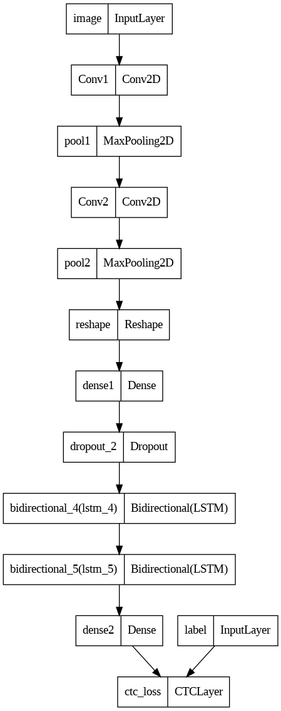
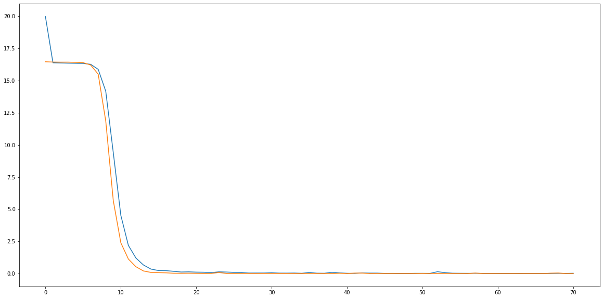
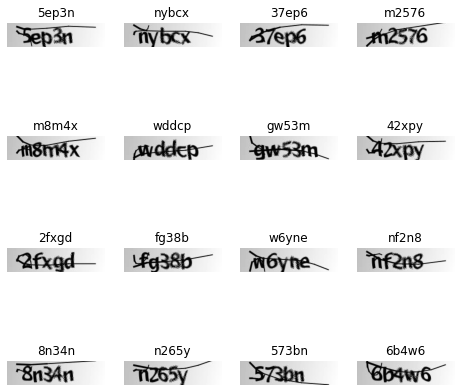

<div style="position: absolute; top: 0; right: 0;">
    <a href="ertugrulbusiness@gmail.com"></a>
    <a href="https://tr.linkedin.com/in/ertu%C4%9Fruldemir?original_referer=https%3A%2F%2Fwww.google.com%2F"></a>
    <a href="https://github.com/ertugruldmr"></a>
    <a href="https://www.kaggle.com/erturuldemir"></a>
    <a href="https://huggingface.co/ErtugrulDemir"></a>
    <a href="https://stackoverflow.com/users/21569249/ertu%c4%9frul-demir?tab=profile"></a>
    <a href="https://medium.com/@ertugrulbusiness"></a>
    <a href="https://www.youtube.com/channel/UCB0_UTu-zbIsoRBHgpsrlsA"></a>
</div>

# Custom Optical Character Recognition
 
## __Table Of Content__
- (A) [__Brief__](#brief)
  - [__Project__](#project)
  - [__Data__](#data)
  - [__Demo__](#demo) -> [Live Demo](https://ertugruldemir-customocr.hf.space)
  - [__Study__](#problemgoal-and-solving-approach) -> [Colab](https://colab.research.google.com/drive/1tbB8LoNsHvP0ZF-CO4neTkMZ382kMx_h)
  - [__Results__](#results)
- (B) [__Detailed__](#Details)
  - [__Abstract__](#abstract)
  - [__Explanation of the study__](#explanation-of-the-study)
    - [__(A) Dependencies__](#a-dependencies)
    - [__(B) Dataset__](#b-dataset)
    - [__(C) Modelling__](#c-modelling)
    - [__(D) Deployment as web demo app__](#g-deployment-as-web-demo-app)
  - [__Licance__](#license)
  - [__Connection Links__](#connection-links)


## __Brief__ 

### __Project__ 
- This is a __Optical Character Recognition__ project on image data  with  __deep learning model__. The project uses the  [__CAPTCHA Image Dataset__](https://www.kaggle.com/datasets/fournierp/captcha-version-2-images) to __Character recognition__ from an image.
- The __goal__ is build a deep learning model that accurately __recognite character__  from image data.
- The performance of the model is evaluated using several __metrics__ loss.

#### __Overview__
- This project involves building a deep learning model to extract structured information as character from image. This dataset contains CAPTCHA (Completely Automated Public Turing test to tell Computers and Humans Apart) images. The images are 5 letter words that can contain numbers. The images have had noise applied to them (blur and a line). They are 200 x 50 PNGs. The models selected according to model tuning results, the progress optimized respectively the previous tune results. The project uses Python and several popular libraries such as Pandas, NumPy, tensorflow.

#### __Demo__

<div align="left">
  <table>
    <tr>
    <td>
        <a target="_blank" href="https://ertugruldemir-customocr.hf.space" height="30">[Demo app] HF Space</a>
      </td>
      <td>
        <a target="_blank" href=https://colab.research.google.com/drive/1k2LAfBOIJdeNxhSEaGTjBsNy4Wqb2_bW"">[Demo app] Run in Colab</a>
      </td>
      <td>
        <a target="_blank" href="https://github.com/ertugruldmr/CustomOCR/blob/main/study.ipynb">[Traning pipeline] source on GitHub</a>
      </td>
    <td>
        <a target="_blank" href="https://colab.research.google.com/drive/1tbB8LoNsHvP0ZF-CO4neTkMZ382kMx_h">[Traning pipeline] Run in Colab</a>
      </td>
    </tr>
  </table>
</div>


- Description
    -  __recognite character__ from image data.
    - __Usage__: 
      - upload your text then clict the button for extraction
- Embedded [Demo](https://ertugruldemir-customocr.hf.space) window from HuggingFace Space
    

<iframe
	src="https://ertugruldemir-customocr.hf.space"
	frameborder="0"
	width="850"
	height="450"
></iframe>

#### __Data__
- The [__CAPTCHA Image Dataset__](https://www.kaggle.com/datasets/fournierp/captcha-version-2-images) from kaggle dataset api.
- The dataset contains CAPTCHA (Completely Automated Public Turing test to tell Computers and Humans Apart) images.
  - The images are 5 letter words that can contain numbers.
  - The images have had noise applied to them (blur and a line). 
  - They are 200 x 50 PNGs.

#### Problem, Goal and Solving approach
- This is a __Optical Character Recognition__ problem  that uses the  [__CAPTCHA Image Dataset__](https://www.kaggle.com/datasets/fournierp/captcha-version-2-images)  to __recognite character__ from given image.
- The __goal__ is build a deep learning  model that accurately __recognite characters__ from image data.
- __Solving approach__ is that using the supervised deep learning models. Basic Custom convolutional model is used for information extraction. 

#### Study
The project aimed recogniting the characters using deep learning model architecture. The study includes following chapters.
- __(A) Dependencies__: Installations and imports of the libraries.
- __(B) Dataset__: Downloading and loading the dataset. Preparing the dataset from official website. Configurating the dataset performance and related pre-processes. 
- __(C) Preprocessing__: type casting, scaling the pixel values, resizing, transposing, encoding, configurating the dataset object, batching, performance setting, visualizating, Implementing related processing methods on train dataset and image related processes.
- __(D) Modelling__:
  - Model Architecture
    - Custom convolutional neural network model used. The model includes convolutional layers and bidirectional layers.
    - Custom Architecture
      <div style="text-align: center;">
        
      </div>
  - Training
    - Callbakcs and trainin params are setted. some of the callbacks are EarlyStopping, ModelCheckpoint, Tensorboard etc....  
    - Training history
      <div style="text-align: center;">
        
      </div>
  - Saving the model
    - Saved the model as tensorflow saved model format.
- __(E) Deployment as web demo app__: Creating Gradio Web app to Demostrate the project.Then Serving the demo via huggingface as live.

#### results
- The final model is __ocr_model__ as Custom convolutional neural network because of the results and less complexity.
  -  Custom convolutional neural network 
        <table><tr><th>Model Results </th><th></th></tr><tr><td>
  |   | loss  | val_loss  |
  |---|-------|-------|
  |   | 0.0258 | 0.0030 |
    </td></tr></table>

## Details

### Abstract
- [__CAPTCHA Image Dataset__](https://www.kaggle.com/datasets/fournierp/captcha-version-2-images)  is used to extract character recognition from image data. The goal is build a deep learning model that accurately recognite characters from image data using through custom convolutional deep learning algorithms which include bidirection mechanicsm  or related training approachs of pretrained state of art models.The study includes creating the environment, getting the data, preprocessing the data, exploring the data, type casting, scaling the pixel values, resizing, transposing, encoding, configurating the dataset object, batching, performance setting, visualizating, modelling the data, saving the results, deployment as demo app. Training phase of the models implemented through tensorflow callbacks. After the custom model traininigs, transfer learning and fine tuning approaches are implemented. Selected the basic and more succesful when compared between other models, the final model is Custom convolutional neural network model which include bidirection mechanicsm. __Custom convolutional neural network__ model  has __0.0258__ loss, __0.0030__ val_loss other metrics are also found the results section. Created a demo at the demo app section and served on huggingface space.  


### File Structures

- File Structure Tree
```bash
├── demo_app
│   ├── app.py
│   ├── char_to_num
│   ├── num_to_char
│   ├── Examples
│   ├── ocr_model
│   └── requirements.txt
├── docs
│   └── images
├── env
│   ├── env_installation.md
│   └── requirements.txt
├── readme.md
└── study.ipynb
```
- Description of the files
  - demo_app/
    - Includes the demo web app files, it has the all the requirements in the folder so it can serve on anywhere.
  - demo_app/ocr_model:
    - Custom convolutional neural network model Which includes bidirection mechanicsm and saved as tensorflow saved_model format.
  - demo_app/char_to_num
    - Encoding map pickle file.
  - demo_app/num_to_char
    - Decoding map pickle file.
  - docs/
    - Includes the documents about results and presentations
  - env/
    - It includes the training environmet related files. these are required when you run the study.ipynb file.
  - LICENSE.txt
    - It is the pure apache 2.0 licence. It isn't edited.
  - readme.md
    - It includes all the explanations about the project
  - study.ipynb
    - It is all the studies about solving the problem which reason of the dataset existance. 
  - requirements.txt
    - It includes the library dependencies of the study.   

### Explanation of the Study
#### __(A) Dependencies__:
  - There is a third-part dependency which is kaggle dataset api. You can create an environment via env/requirements.txt. Create a virtual environment then use hte following code. It is enough to satisfy the requirements for runing the study.ipynb which training pipeline.
  - Dataset can download from huggingface dataset.
#### __(B) Dataset__: 
  - Downloading the [__CAPTCHA Image Dataset__](https://www.kaggle.com/datasets/fournierp/captcha-version-2-images)  via huggingface dataset api. 
- The dataset contains CAPTCHA (Completely Automated Public Turing test to tell Computers and Humans Apart) images.
  - The images are 5 letter words that can contain numbers.
  - The images have had noise applied to them (blur and a line). 
  - They are 200 x 50 PNGs.
  -  type casting, scaling the pixel values, resizing, transposing, encoding, configurating the dataset object, batching, performance setting, visualizating, Implementing related processing methods on train dataset and image related processes.
  - Example Data
      <div style="text-align: center;">
        
      </div>

#### __(C) Modelling__: 
  - The processes are below:
    - Model Architecture
      - Custom convolutional neural network model used. The model includes convolutional layers and bidirectional layers.
      - Custom Architecture
        <div style="text-align: center;">
          
        </div>
  - Training
    - Callbakcs and trainin params are setted. some of the callbacks are EarlyStopping, ModelCheckpoint, Tensorboard etc....  
    - Training history
      <div style="text-align: center;">
        
      </div>
    - Saving the model
      - Saved the model as tensorflow saved model format.
  - __(E) Deployment as web demo app__: Creating Gradio Web app to Demostrate the project.Then Serving the demo via huggingface as live.

  #### results
  - The final model is __Custom Transformer Multi Head Attention Network__ as Custom tranformer network which includes attention mechanicsm because of the results and less complexity.
  -  Custom convolutional neural network 
        <table><tr><th>Model Results </th><th></th></tr><tr><td>
  |   | loss  | val_loss  |
  |---|-------|-------|
  |   | 0.0258 | 0.0030 |
    </td></tr></table>
    - Saving the project and demo studies.
      - trained model __Custom convolutional neural network__ as tensorflow (keras) saved_model format.

#### __(D) Deployment as web demo app__: 
  - Creating Gradio Web app to Demostrate the project.Then Serving the demo via huggingface as live.
  - Desciption
    - Project goal is recogniting characters from given image.
    - Usage: upload your image for character recognition then use the button to predict.
  - Demo
    - The demo app in the demo_app folder as an individual project. All the requirements and dependencies are in there. You can run it anywhere if you install the requirements.txt.
    - You can find the live demo as huggingface space in this [demo link](https://ertugruldemir-customocr.hf.space) as full web page or you can also us the [embedded demo widget](#demo)  in this document.  
    
## License
- This project is licensed under the Apache 2.0 License. See the [LICENSE](LICENSE) file for details.

<h1 style="text-align: center;">Connection Links</h1>

<div style="text-align: center;">
    <a href="ertugrulbusiness@gmail.com"></a>
    <a href="https://tr.linkedin.com/in/ertu%C4%9Fruldemir?original_referer=https%3A%2F%2Fwww.google.com%2F"></a>
    <a href="https://github.com/ertugruldmr"></a>
    <a href="https://www.kaggle.com/erturuldemir"></a>
    <a href="https://huggingface.co/ErtugrulDemir"></a>
    <a href="https://stackoverflow.com/users/21569249/ertu%c4%9frul-demir?tab=profile"></a>
    <a href="https://www.hackerrank.com/ertugrulbusiness"></a>
    <a href="https://app.patika.dev/ertugruldmr"></a>
    <a href="https://medium.com/@ertugrulbusiness"></a>
    <a href="https://www.youtube.com/channel/UCB0_UTu-zbIsoRBHgpsrlsA"></a>
</div>

